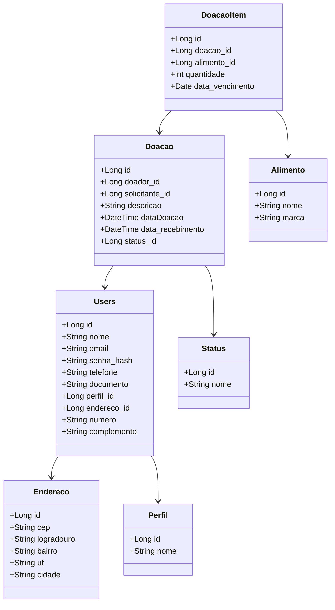

<h1> Doação de Alimentos </h1>

Doações podem ser anunciadas após o cadastro do doador, e solicitadas. Essas solicitações podem ser feita por usuários (cadastrados), no papel de solicitantes. 
As doações já solicitadas e entregues, entram no status de concluídas.

A ideia é que o usuário possa ter informações de contato dos doadores, para que eles combinem os encontros para a entrega das doações, algo semelhante com as vendas 
com “entrega a combinar” em plataformas como a OLX, por exemplo.

<h2> Levantamento de requisitos </h2>
<h4> O sistema irá contar com os requisitos:</h4>

- O sistema não permitirá cadastrar um documento inválido;
- O sistema não permitirá cadastrar um e-mail inválido;
- O sistema não permitirá cadastrar um número de telefone inválido;
- O sistema não permitirá um endereço inválido;
- O sistema não permitirá cadastrar uma doação sem os dados obrigatórios: Id do alimento, Id do doador, status.
- O sistema não permitirá anunciar um alimento com data de validade anterior a data atual, ou a menos de 1 semana de vencer;
- O sistema não permitirá excluir um doador com doações pendentes;
- O sistema não permitirá cadastrar uma doação com alimentos inválidos;
- O sistema não permitirá cadastrar uma doação com quantidade menor ou igual a 0;
- O sistema não permitirá cadastrar um usuário sem o perfil válido (doador ou solicitante);

<h2>Diagrama do Banco de dados:</h2>



<h2>Como rodar </h2>

1. Faça clone do projeto: ```git clone git@github.com:delmiraugusto/DoacaoAlimentos.git```
2. Certifique de ter o python instalado: ```python --version```
3. Crie um ambiente virtual(venv): ```python -m venv venv```
4. Use o comando: ```.\venv\Scripts\Activate.ps1 para ativar a venv```
5. Instale as dependencia do requirements.txt: ```pip install -r requirements.txt```
6. Rode o projeto com: ```flask --app manage run --host=0.0.0.0 --port=8080```


